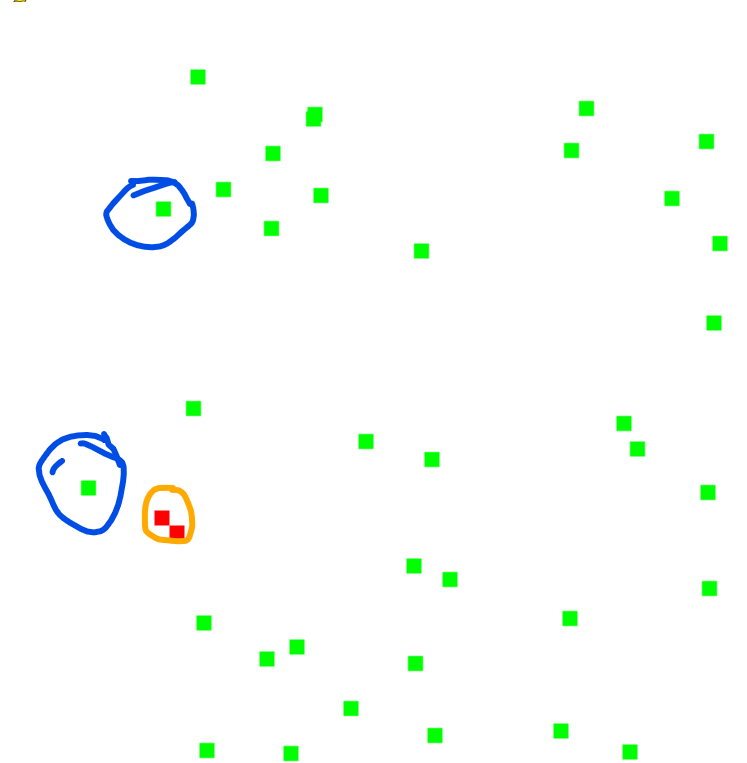

# Simulation Evolution

This is a simulation of evolution based on a genetic algorithm and pygame.


## Содержание
1. [About](README.md/#about) - основное (зачем, где что располагается)
2. [Этапы](README.md/#этапы) - процесс разработки и выполненой работы.
3. [Useful Links](/README.md/#useful-links) - полезные ссылки со статьями и используемыми сайтами.

## <u> **About** </u>
Генетический алгоритм - это алгоритм оптимизации, представленный с помощью симуляции естественного отбора из реальной жизни. Данный алгоритм использует визуализированный пример естественного отбора.

В папке [scr](/scr/) находиться файл [main.py](/scr/main.py), в котором находится осоновной код программы.

В папке [scr](/scr/) находиться файл [component.py](/scr/component.py), который хранит в себе основные компоненты, присущие всем повторяющимся элементам в программе.

В папке [image](/image/) находятся все скриншоты и изображения игры.

## <u><b> Этапы </b></u>

1. Этап создания движения персонажа и начальная отрисовка всех компонентов (поле, первый персонаж, еда).
    > необходимо реализовать движение игрока без человесеского вмешательства.

2. Создание механики движения персонажа самостоятельно. <br>
Для этого был добавлен новый цикл в программе, формирующий список кортежей, где значения кортежей - это координаты обьекта еды _(x, y)_. Далее использкется стандартная сортировка python через метод ```sorted()```. На выходе получаем осортированный список кортежей по первому значению <font color=#aabbff> т.е по координате __X__</font>.

    
    Рисунок 1.

    
    
    Рисунок 2 - синее это то, что обьект героя не сумел захватить (очки при этом начислились), а красным - то, что случается с игроком на большой скорости.

    Частично первую проблему удалось решить путем изменения параметра ```self.FPS``` в классе экрана, но это не сильно повлияло на окончательный результат.

## <u> **Useful Links** </u>
1. Python - [python.org](https://python.org)
2. PyGame - [pygame.org](https://www.pygame.org)
3. PyGame lessons - [youtube](https://youtube.com/playlist?list=PLA0M1Bcd0w8xg_hyqpPpHdbZnPubSyIQ_)

-------------------
###### 27.03.2023 - last README.